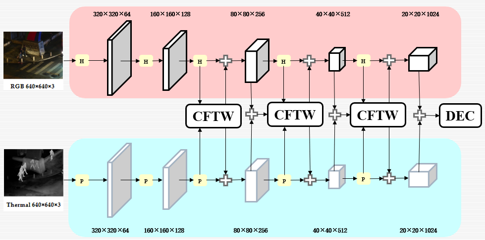
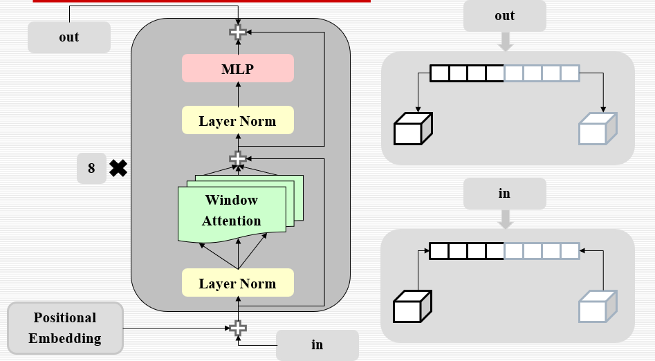
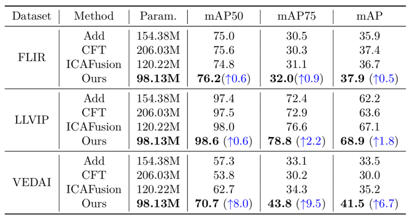
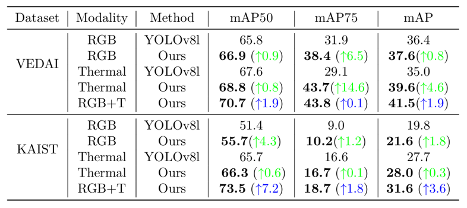

## <div align="center">CFTW: multimodal object detection based on Window Attention transformer</div>
### Introduction
rt 

Note：This project has been improved since CFT
### Overview
<div align="center">
  
  <div style="color:orange; border-bottom: 10px solid #d9d9d9; display: inline-block; color: #999; padding: 10px;"> Fig 1. Overview of our multispectral object detection framework </div>
</div>
<div align="center">
  
  <div style="color:orange; border-bottom: 10px solid #d9d9d9; display: inline-block; color: #999; padding: 10px;"> Fig 2. The CFTW module </div>
</div>

### Installation
Clone repo and install requirements.txt in a Python>=3.8.0 conda environment, including PyTorch>=1.12.
```
git clone https://github.com/pluto10072/CFTW.git
cd CFTW
pip install -r requirements.txt
```
### Results update
<div align="center">
  
  <div style="color:orange; border-bottom: 10px solid #d9d9d9; display: inline-block; color: #999; padding: 10px;"> Fig 3. Comparison Experiment Diagram </div>
</div>

<div align="center">
  
  <div style="color:orange; border-bottom: 10px solid #d9d9d9; display: inline-block; color: #999; padding: 10px;"> Fig 4. Ablation Experiment Diagram </div>
</div>

